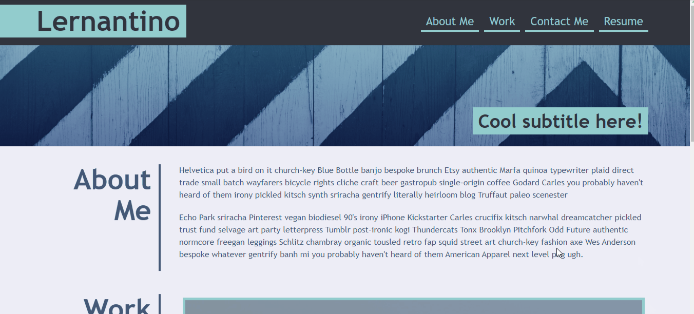
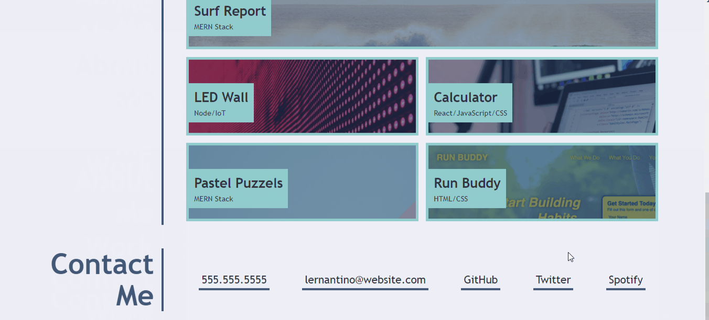

# Portfolio Website for Oladimeji Ipaye

The purpose of this repository is to create a website portfolio to showcase my HTML and CSS skills I have learned so far in the Birmingham University Skills Bootcamp. 
This is a module 2 assignment from the bootcamp and I am meant to download the starter files I've been given and use it to build the portfolio site, then deploy it to this github repo.

## Website Portfolio Challenge

The above image is the starter portfolio high-quality mockup I was given to work with and my assignment is to create a portfolio website that is similar to it.

## My Goal

## The Outcome

## Conclusion

