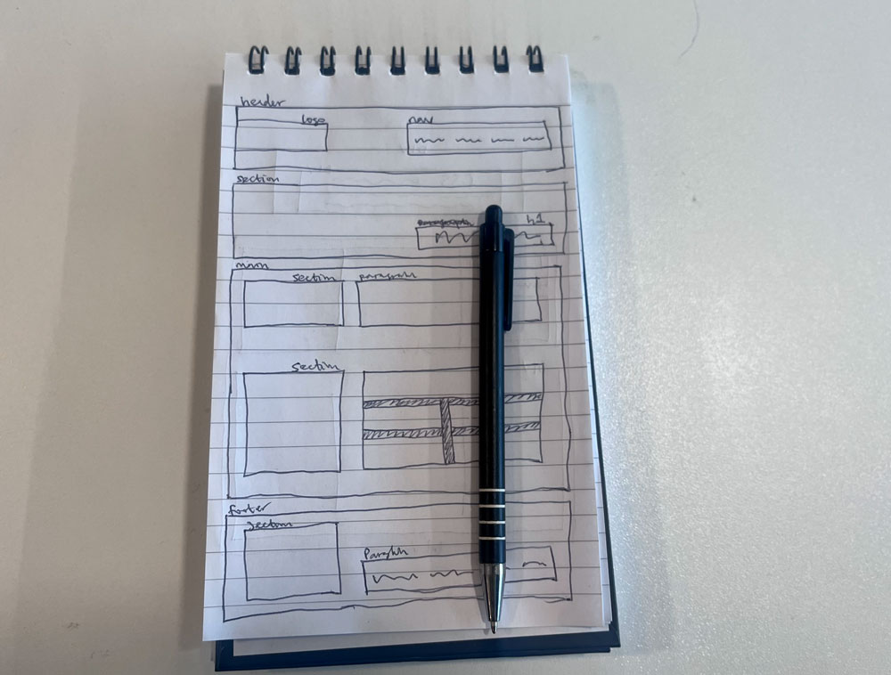
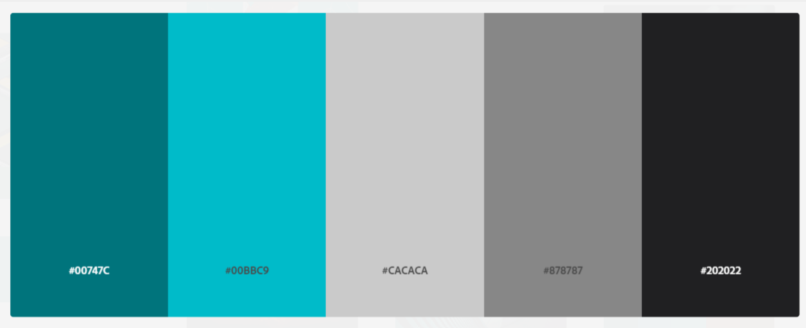

# Portfolio Website for Oladimeji Ipaye

The purpose of this repository is to create a website portfolio to showcase my HTML and CSS skills I have learned so far in the Birmingham University Skills Bootcamp. 
This is a module 2 assignment from the bootcamp and I am meant to download the starter files I've been given and use it to build the portfolio site, then deploy it to this github repo.

## Website Portfolio Challenge

The above image is the starter portfolio high-quality mockup I was given to work with and my assignment is to create a portfolio website that is similar to it.

## Task

When the page is loaded the page presents your name, a recent photo or avatar, and links to sections about you, your work, and how to contact you.

When one of the links in the navigation is clicked then the UI scrolls to the corresponding section.

When viewing the section about your work then the section contains titled images of your applications.

When presented with the your first application then that application's image should be larger in size than the others.

When images of the applications are clicked then the user is taken to that deployed application

When the page is resized or viewed on various screens and devices then the layout is responsive and adapts to my viewport.

## My Plan

Start with wireframing. We learned about wireframing a web application before coding it in module 2. So I will do a rough sketch on paper of what the portfolio website will look like before opening VS code.

Then I will create the html structure. So that I can style it properly using the Stylesheet. I noticed the linked stylesheet in the starter files wasn't the correct path for my local files, so I updated it as well as the index.html page.

For the color scheme, I will use an inviting color scheme because I want potential employers to feel welcomed when they land on my portfolio website.

## The Outcome

A beautifully designed portfolio website using my html and css skills.

## Conclusion

This portfolio website assignment was very challenging and using the flexbox was the hardest thing I've had to do in this bootcamp so far.

